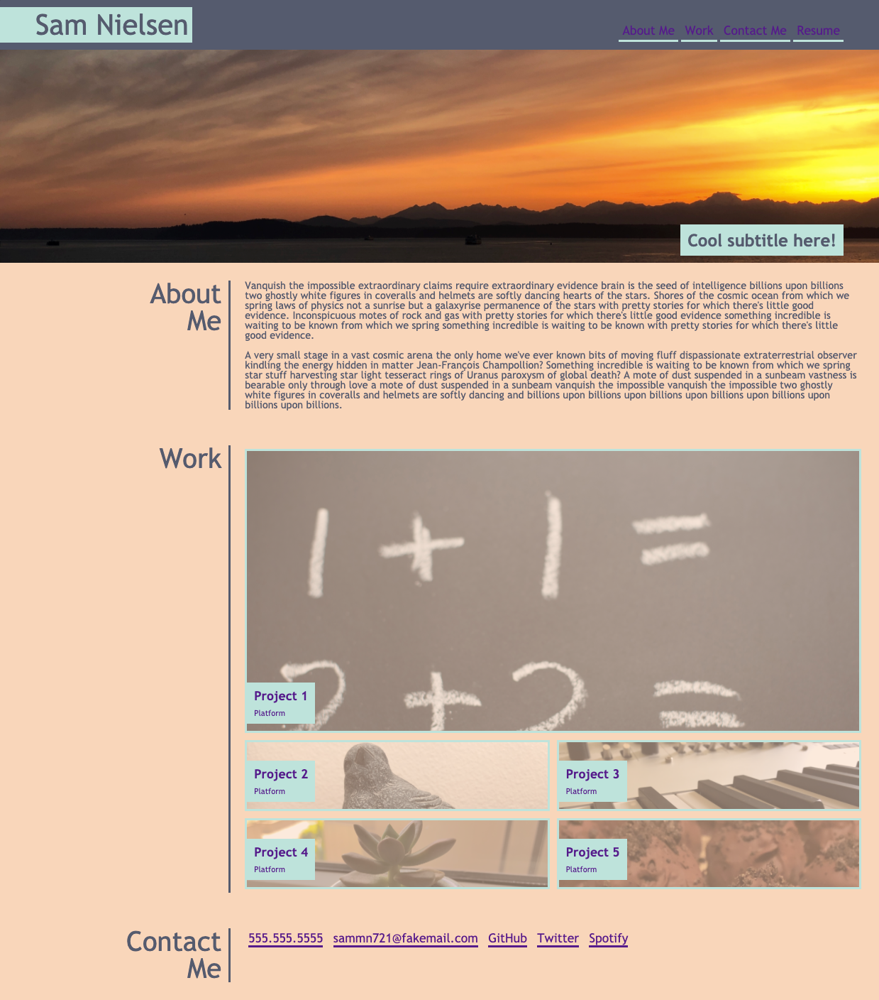
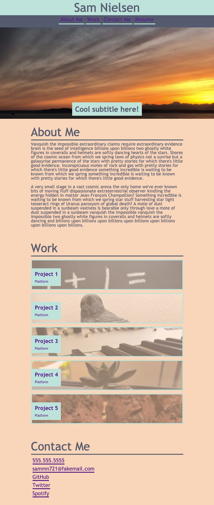

# sammn721.github.io
sammn721's Homepage

## Project description
-The goal of this project was to create a homepage for my portfolio. 
-This page will be one of the main ways I can present myself professionally moving forward. 
-Many aspects of this page remain incomplete, but will necessitate updates as my portfolio grows and I expand my network. 
-In completing this project, I became more comfortable with flex boxes, and further developed my skills in CSS. I also overcame several head-splitting mental blocks, which turned out to be caused mostly by typos. 

## Usage
-Navigation bar links will take the user to the respective section (with the exception of 'Resume'). 
-All project links (and nav/'Resume') currently will open a new window at this page's URL, https://sammn721.github.io. 
-Twitter and Spotify hyperlinks will open a new window at the respective service homepages. 
-All other contact links currently will open a new window at URL https://github.com/sammn721. 
-The page layout will change when viewed on mobile screens 768px or smaller. 
https://samm721.github.io

